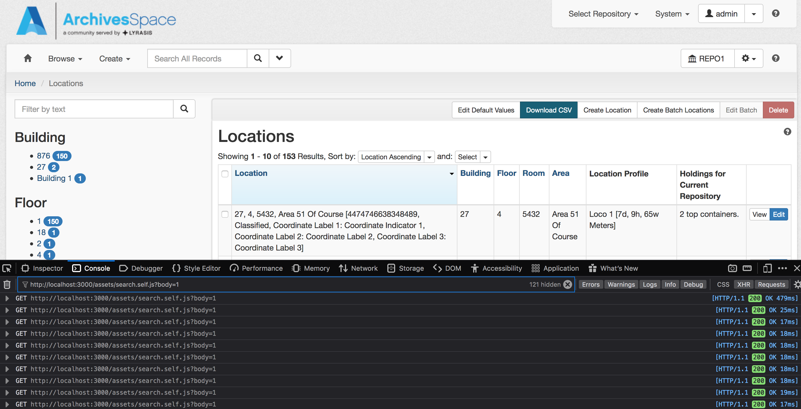
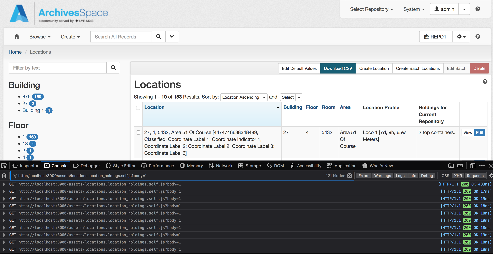

# GH [#1920](https://github.com/archivesspace/archivesspace/issues/1920)

Not only is there a synchronous XHR warning, but two javascript files are requested 10x each, for a total of 18 requests too many.

There are 3 fixes that I've worked out:

1. Keep the sync xhr error, but move the script includes out of the loop and up the DOM but inside the modal (ugly because has sync warning, which isn't the end of the world, but it _is_ a deprecation warning, which is perhaps the worst kind of warning)
2. Write move locations.location_holdings.js code to a `<script>` block inside the modal but up the DOM from the loop (really ugly because rails practices)
3. Add event listener on the "Browse" button related to each of the 3 location linkers I've found[0] via locations.location_holdings.js, then use a `setTimeout` to give the modal enough time to load in the DOM before running `init_locationHoldingsSearch()` on the DOM (ugly because setTimeout, perhaps 400ms is too brittle?)

## The duplicated scripts

Both screenshots are shown on the main locations index view (http://localhost:3000/locations), which doesn't have the sync warning, because the js include tag is written to the initial DOM load rather than DOM appeneded after modal load.

1. http://localhost:3000/assets/search.self.js?body=1

2. http://localhost:3000/assets/locations.location_holdings.self.js?body=1

[0]

- frontend/app/views/top_containers/bulk_operations/\_location_linker.html.erb
- frontend/app/views/locations/\_linker.html.erb
- frontend/app/views/locations/index.html.erb
