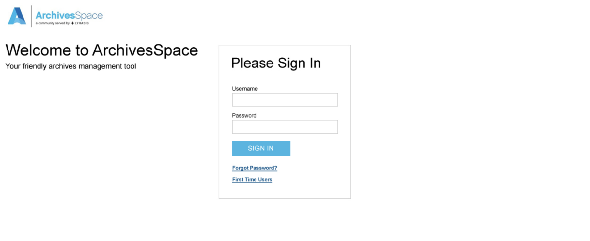

# Notes for ANW-953-login-panel

## Ticket

[ANW-953](https://archivesspace.atlassian.net/browse/ANW-953)

## Design goal



## Related files

- `frontend/app/views/shared/_header_global.html.erb`
- `frontend/app/views/layouts/application.html.erb`
- `frontend/app/views/welcome/index.html.erb`
  - this is where `shared/login` gets rendered!
- `frontend/app/helpers/welcome_helper.rb`
- `frontend/app/views/shared/_login.html.erb`
- `frontend/app/controllers/session_controller.rb`
- `frontend/config/locales/en.yml`
- `frontend/app/views/shared/_header_user.html.erb`
  - need to remove everything after the else on line 98, and figure out if ruby `if` needs an `else`, if so, have to figure out with what to replace the content; what gets removed from here is what should go to the Welcome view (ie: it contains/starts the login form); it will change though, ie, it will no longer have a `<li>` as root, there won't be an `<a>` parent of the partial `shared/login`, it will just be about rendering the partial!
- `frontend/app/views/401.html.erb`
- `frontend/app/views/403.html.erb`
- `frontend/app/controllers/welcome_controller.rb`
- `frontend/config/locales/help/en.yml`
- `frontend/config/initializers/help.rb`
- `frontend/app/assets/stylesheets/archivesspace/header.less`
- `frontend/app/assets/stylesheets/archivesspace/form.less`
  - need to add the following styles to the login form input button so that we can remove the class `navbar-btn` from it to decouple it from the navbar, since it will no longer be in the navbar. We should also probably decouple the i18n login data from the navbar section.
  ```css
  input[name='commit'] {
    margin-top: 8px;
    margin-bottom: 8px;
  }
  ```
- `frontend/app/views/shared/_modal.html.erb`
  - this partial (`shared/modal`) gets passed `shared/login`, so we def cannot put the `<main>` inside `shared/login`; best to keep the main el in the Welcome index view.

## Scope of task

- The question mark next to the sign in button, which represents/is a link to the "ArchivesSpace Help Center" is implicated in this task.
