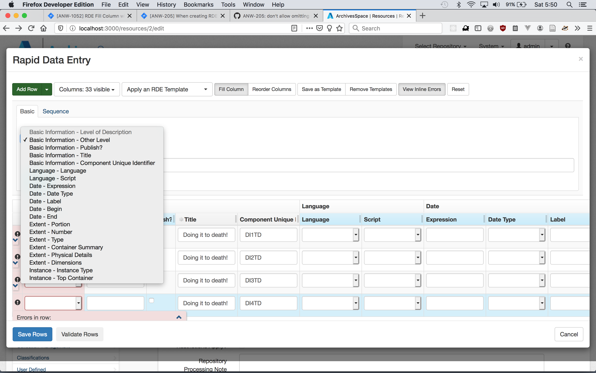

# Notes on [ANW-921](https://archivesspace.atlassian.net/browse/ANW-921)

My first public interface work.

## Problem

Here's the view of the current citation modal:

The live path is `/resources/:resource_id`

## Related files

- `public/app/views/resources/show.html.erb`
  - modal_actions partial is used from here
- `public/app/views/shared/\_modal_actions.html.erb`
- `public/app/assets/javascripts/cite.js`
- `public/app/views/resources/infinite.html.erb`
  - modal_actions partial is used from here
- `public/app/views/resources/infinite.html.erb`
  - modal_actions partial is used from here
- `public/app/views/shared/_page_actions.html.erb`: this list contains the cite button that opens the cite modal
- `public/app/views/shared/_cite_page_action.html.erb`
- `public/app/views/shared/_modal.html.erb`
- `public/app/controllers/cite_controller.rb`
- `public/app/views/cite/show.html.erb` - this only gets used if no js
- `public/config/initializers/public_new_defaults.rb` - this might be where the data comes from that gets added to hidden inputs on the `#cite_sub` citation button; found it by searching for `$RECORD_PAGE_ACTIONS`, which is used in the `_page_actions` view
- `public/app/models/resource.rb` - defines the `:cite` action
- `public/app/models/record.rb` - contains the `cite_url_and_timestamp` def, which is used in `public/app/models/resource.rb` (not a key player file)

## Data flow

1. on a resources view like, `public/app/views/resources/show.html.erb`
2. click the citation button, which is rendered via `_page_actions` and `_cite_page_actions` views
3. the modal is triggered from the existing DOM and made visible; the modal comes from the `_modal` view via the `_modal_actions` view, and via `cite.js`

## Commits

- fix the method typo in `public/app/views/cite/show.html.erb`!

## Questions for Lora

- where is the `@result.cite` data coming from on Line 5 of `public/app/views/shared/_modal_actions.html.erb`?
- i'm having trouble sending a new locals variable from `_modal_actions` to `_modal` - it's like the rails app has some pre-determined set of variables that it will pass between the two, and I can't add any nor change any existing locals variables.
  - what I _can_ do however is to render a different partial from `_modal_actions` - this may be a temporary way forward to show a proof of tabbed modal concept.

## The Solution

The solution includes:

- creating a new tabbed modal template in the shared views dir
- creating the appropriate data for each tab which can be done in 2 ways:
  1. use regex on the front end against the `@result.cite` data as mentioned in the questsions for Lora section above
  2. send both sets of pre-prepared data from the backend to the front end -- THIS IS MY PREFERENCE!

a possible way forward

FOUND IT! Updating the Ruby model file `public/app/models/resource.rb` by adding methods that return the 2 strings that I want is the way forward for this quick and dirty proof of concept.

PROBLEM => getting clipboard.js to work under the new cite modal logic (2 possible citations via dynamic user interface vs 1 hardcoded citation generated at initial page build (before the citation modal is even opened))

let's maybe add an event listener to `public/app/views/shared/_modal_actions.html.erb` where the clipboard.js `setupCite()` function is called on initial page render (ie: replace `setupCite()` with the listener)

- actually, it will be refactoring `setupClip()` around the event listener

### here's the plan

~~we need to watch the copy-to-clipboard button events;~~

1. WRONG! WE NEED TO WATCH THE TAB TOGGLING TO UPDATE THE DATA-ATTR ON THE CLIPBTN!
2. we start with a predetermined active tab and active tab value, which is the value for data-attr on the clipbtn
3. if the tab is toggled, update the data-attr data

OH, Oh, oh, I KNOW - let's subvert the bootstrappyness, and go with their `<a>` tags as the basis for tabs, and let's put the a tags in `<label>` tags!, Thus utilizing the watch nature of input type=radio elements!

## DON'T FORGET

- you have the NO-JS view version that needs to be updated accordingly! (`public/app/views/cite/show.html.erb`)
