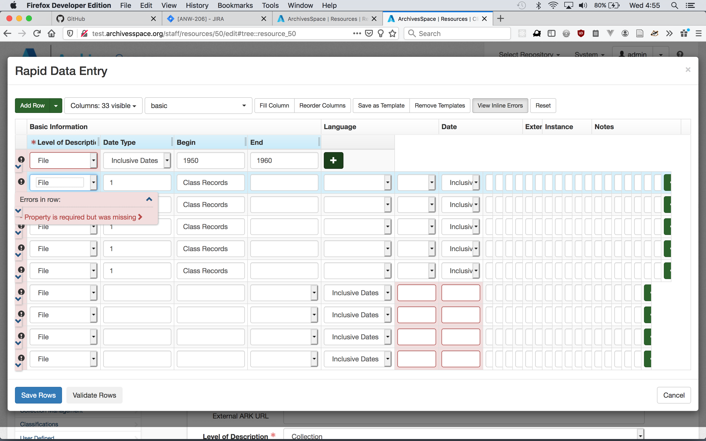

# ANW-206 notes

## Description via Lora

This is one of those really impossible tickets because it really doesn’t give you foolproof ways to replicate the issue, but it _is_ still an issue.

The RDE editor allows users to save RDE Templates (basically, storing visible columns and, if desired, cell data), but those templates often get out of sync leading to shifted display like you saw in ANW-1048 that is often an unusable display (thegreen Add Column “+” button does not display at the far right of the RDE rows).

### Replicate

test.archivesspace.org/staff

- click some templates on/off
- create and save new templates

## Problem

## Related files

- `frontend/app/assets/javascripts/rde.js`
- `frontend/app/views/shared/_rde.html.erb`
- `frontend/app/views/digital_object_components/_rde_templates.html.erb`
- `frontend/app/views/archival_objects/_rde_templates.html.erb`
- `frontend/app/controllers/resources_controller.rb`
- `frontend/app/assets/javascripts/tree_toolbar.js.erb`
